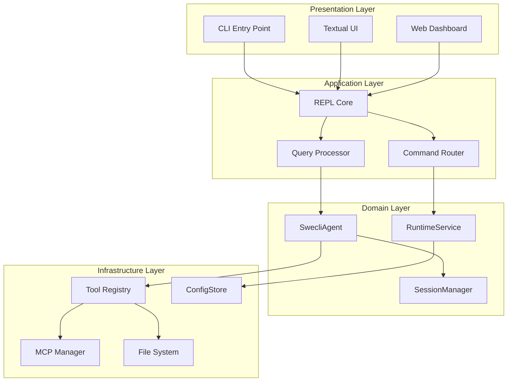
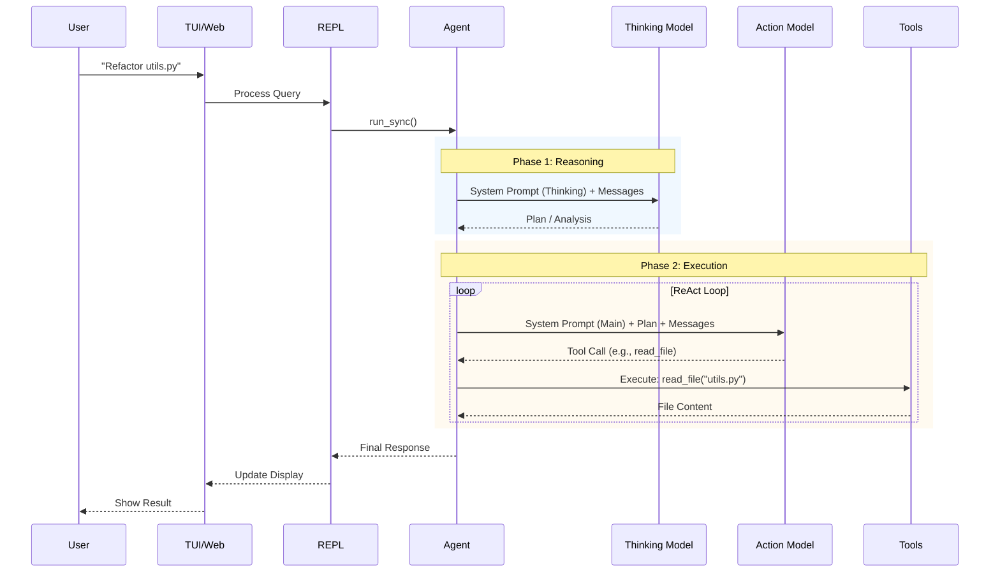

# SWE-CLI Architecture Design

## 1. High-Level Overview

SWE-CLI is an agentic coding assistant designed with a **layered architecture** that separates core AI logic from user interfaces and infrastructure. This enables the system to run in multiple modes (CLI, TUI, Web) while sharing the same underlying intelligence and tool capabilities.

### Architectural Patterns
- **Layered Architecture**: Clear separation between UI, Orchestration, Domain Logic, and Infrastructure.
- **Dependency Injection**: Services and Managers are injected into components (e.g., `RuntimeService`, `AgentDependencies`).
- **ReAct Pattern**: The core agent loop follows Reasoning + Acting via the `SwecliAgent`.
- **Event-Driven UI**: The Textual UI and WebSockets use event-based communication for real-time updates.

### System Architecture Diagram

---

## 2. System Layers

### A. Presentation Layer (Interfaces)
Responsible for handling user input and rendering output.

1.  **Textual UI (TUI)** (`swecli/ui_textual`)
    *   **`TextualRunner`**: The main entry point for the TUI. Bridges the `Textual App` with the `REPL` core.
    *   **`ChatApp`**: The main Textual application class.
    *   **`ConversationLog`**: Renders chat history, tool outputs, and markdown.
    *   **`ConsoleBridge`**: Captures standard output/logs and pipes them to the TUI.

2.  **Web UI** (`swecli/web`)
    *   **`server.py`**: FastAPI (or similar) server providing REST and WebSocket endpoints.
    *   **`routes/`**: API endpoints for chat, config, and tools.
    *   **`WebState`**: Manages session state for web clients.

3.  **Command Line (CLI)** (`swecli/cli.py`)
    *   **`argparse`**: Handles arguments for modes like non-interactive one-shot prompts (`swecli -p "..."`).

### B. Application Layer (Orchestration)
Responsible for coordinating the workflow, managing session state, and routing commands.

1.  **`REPL`** (`swecli/repl/repl.py`)
    *   The central hub. It initializes all managers and services.
    *   **Command Routing**: Handles slash commands (`/mode`, `/mcp`, `/help`) via specific command handlers.
    *   **Query Processing**: Delegates AI tasks to `QueryProcessor`.

2.  **`QueryProcessor`** (`swecli/repl/query_processor.py`)
    *   Orchestrates the execution of a user query.
    *   Invokes the `Agent`.
    *   Handles UI updates via callbacks during execution.

3.  **Managers**:
    *   **`ModeManager`**: Switches between **Global Mode** (Normal) and **Local Mode** (Planning).
    *   **`ApprovalManager`**: Intercepts sensitive actions for user confirmation.
    *   **`UndoManager`**: Tracks file changes to allow rolling back tool actions.

### C. Domain Layer (Core Intelligence)
Contains the business logic, AI agents, and context management.

1.  **`SwecliAgent`** (`swecli/core/agents/swecli_agent.py`)
    *   **The Brain**. Implements the ReAct loop.
    *   **Dual-Phase Execution**: Supports a "Thinking" phase (reasoning only) followed by an "Action" phase (tool use).
    *   **Prompt Builders**: Dynamically constructs system prompts (`SystemPromptBuilder`) based on available tools.

2.  **`RuntimeService`** (`swecli/core/runtime/services.py`)
    *   Constructs the "Agent Suite" (Normal Agent, Planning Agent).
    *   Manages the lifecycle of agents and injects dependencies.

3.  **Context Engineering** (`swecli/core/context_engineering`)
    *   **`SessionManager`**: Manages the conversation history (messages, tokens).
    *   **`ContextDisplay`**: Selects and formats relevant context (files, snippets) for the LLM.

### D. Infrastructure Layer (Tools & IO)
Provides the actual capabilities to interact with the system and world.

1.  **Tool Registry**
    *   Central registry of all available tools.
    *   Executes tools and returns results to the agent.

2.  **Native Tools** (`swecli/core/context_engineering/tools/implementations`)
    *   **`FileOperations`**: Read/List files.
    *   **`EditTool` / `WriteTool`**: Modify code.
    *   **`BashTool`**: Execute shell commands.
    *   **`WebFetchTool`**: Browse the internet.

3.  **MCP (Model Context Protocol)** (`swecli/core/context_engineering/mcp`)
    *   **`MCPManager`**: Connects to external MCP servers to extend capabilities dynamically (e.g., connecting to a postgres DB or external API).

4.  **Configuration**
    *   **`ConfigManager`**: Manages persistent configuration (API keys, preferences) stored on disk.

---

## 3. Data Flow

### Sequence Diagram: User Query

### Scenario: User asks "Refactor utils.py" in TUI

1.  **Input**: User types "Refactor utils.py" in the TUI Input bar.
2.  **Routing**: `ChatApp` sends the message to `TextualRunner`, which queues it in `MessageProcessor`.
3.  **Processing**: `TextualRunner` calls `REPL._process_query("Refactor utils.py")`.
4.  **Delegation**: `REPL` calls `QueryProcessor.process_query()`.
5.  **Agent Loop**:
    *   `QueryProcessor` calls `SwecliAgent.run_sync()`.
    *   **Thinking**: Agent calls LLM (Thinking Model) to plan the refactor.
    *   **Acting**: Agent calls LLM (Action Model) with tools.
    *   **Tool Call**: LLM suggests `read_file("utils.py")`.
6.  **Tool Execution**:
    *   `SwecliAgent` receives tool call.
    *   Executes `FileOperations.read_file()`.
    *   **Callback**: `TextualRunner` receives `on_tool_call` and `on_tool_result` events, updating the UI spinner and logs.
7.  **Loop Continue**: Agent receives file content, then calls `edit_tool()`.
8.  **Completion**: Agent finishes and returns a summary.
9.  **Display**: `TextualRunner` renders the final assistant message in `ConversationLog`.

---

## 4. Key Design Principles

*   **Mode-Based Operation**: The system distinguishes between **Planning** (Architectural decisions, big picture) and **Normal/Execution** (Implementation).
*   **Safety First**: High-risk tools (Bash, File writes) can be gated behind `ApprovalManager`.
*   **Extensibility**: New capabilities can be added via **Skills** (custom instructions) or **MCP Servers** (executable tools) without changing core code.
*   **Context Awareness**: The system actively manages context, ensuring the LLM sees relevant files and history without overflowing context windows.
